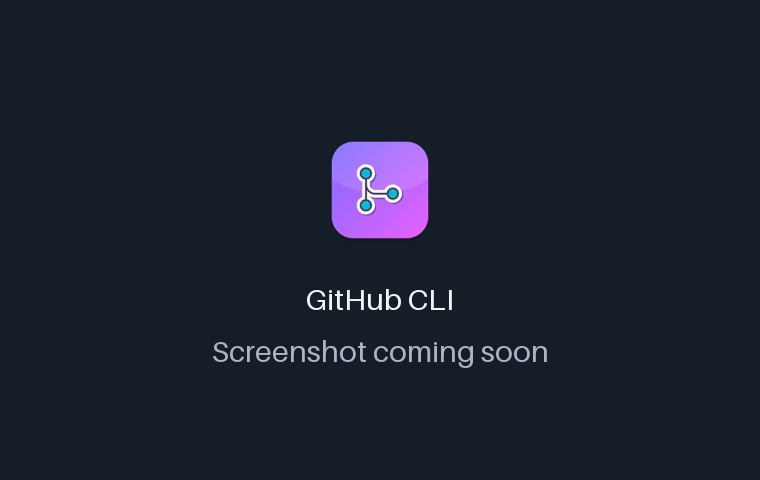
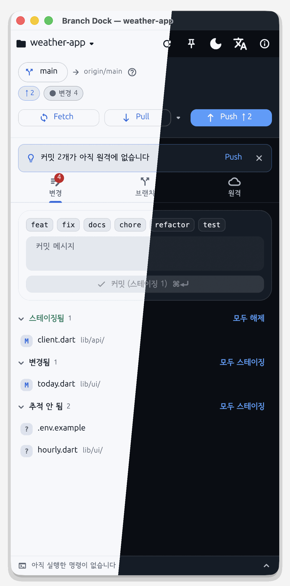
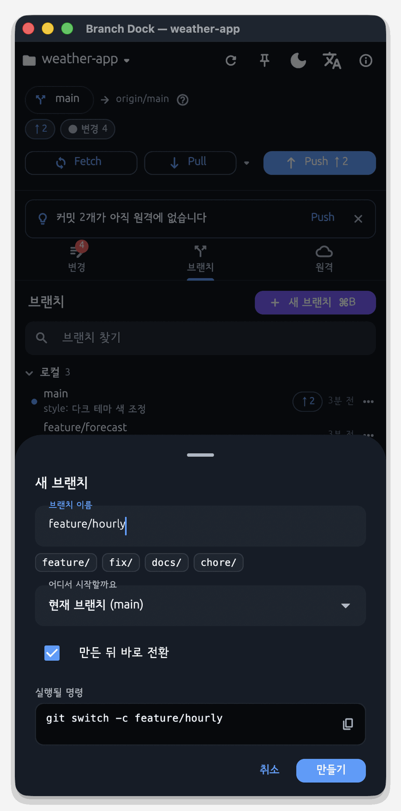

<!-- From jejezz/application-release-templates common/tool/readme @ conventions-v1.
     Generated by tool/readme/init_readme.py — see conventions/readme-guide.md.
     Fill every {{TODO: …}}; tool/readme/check_readme.py fails while any is left. -->

<p align="center">
  
</p>

<h1 align="center">Branch Dock</h1>

<p align="center">
  A free, open-source <b>desktop companion for Git and the GitHub CLI</b> — dock it beside your editor and handle branches, tags, merges, pull/push, remotes and releases with buttons that show the exact command they run.
</p>

<p align="center">
  <a href="https://github.com/jejezz/branch-dock-flutter/releases/latest"></a>
  <a href="https://github.com/jejezz/branch-dock-flutter/releases"></a>
  
  
  <a href="LICENSE"></a>
</p>

<p align="center">
  <b>English</b> · <a href="README.ko.md">한국어</a>
</p>

<p align="center">
  
</p>

## Features

- **A tall window that sits beside your editor** — 440×960 by default, down to 380px wide. Saves in your editor and commits from a terminal show up right away, and it can stay on top
- **Status at a glance, one next step** — branch → upstream, ↑ commits to push / ↓ commits to pull and the number of changes stay at the top, with one suggestion such as "2 commits aren't on the remote yet [Push]"
- **Fetch · pull · push · publish** — remembers the pull method (merge / rebase / fast-forward only) per repository, and publishes (`git push -u`) branches that aren't on the remote yet
- **Branches and remotes** — create (with name checks), switch, rename, delete and delete-on-remote; add remotes, change URLs, switch HTTPS↔SSH, and publish to GitHub with `gh repo create`
- **Buttons that show their command** — every form shows the `git`/`gh` command it will run, and the command log (⌘J) keeps the output, so you learn the commands as you go
- **Confusing words, drawn** — fetch vs. pull, upstream, fast-forward, merge commit and rebase explained as the word → what it means in git → a commit graph. The 12 most common errors come with the reason and the fix
- **Light & dark, English & 한국어** — follows the system, or pick one in the toolbar

<p align="center">
  
  
</p>

## Install

Download from [**Releases**](https://github.com/jejezz/branch-dock-flutter/releases/latest):

| OS | File |
|---|---|
| macOS 12.0+ | `BranchDock-<version>-macos-universal.dmg` — open it and drag Branch Dock to Applications |
| Windows 10/11 (x64) | `BranchDock-<version>-windows-x64-setup.exe` |
| Linux (x64) | `BranchDock-<version>-linux-x64.tar.gz` — extract and run `./install.sh` (`--remove` to uninstall) |

**Windows:** the installer isn't code-signed yet, so SmartScreen says "Windows protected your PC" — choose **More info → Run anyway**.

## How it works

Branch Dock doesn't reimplement git. It runs the `git` and `gh` you have installed, with argument lists and no shell, and reads only machine-readable output (`git status --porcelain=v2`, `git for-each-ref`, `gh --json`), so it isn't thrown off by git versions or locale settings. What you do in the app and what you do in a terminal always agree, and the command each button shows can be copied and run as is.

## Development

```bash
flutter pub get
flutter run -d macos
```

To run it you also need [git](https://git-scm.com) and the [GitHub CLI](https://cli.github.com) (`gh`) installed and logged in (`gh auth login`). Branch Dock calls the ones you have; it never bundles them. Git operations work with any host, but pull requests, releases and Actions need a GitHub remote — `gh` is GitHub-only.

Plans: [PLAN.md](PLAN.md) (features), [UI_UX.md](UI_UX.md) (screens).

Releasing: `scripts/bump-version.sh patch`, merge, then tag `vX.Y.Z` — CI builds and publishes every platform. Rules: [application-release-templates/conventions](https://github.com/jejezz/application-release-templates/tree/main/conventions).

## Credits

- Font: [SeoulNamsan](https://www.seoul.go.kr/seoul/font.do) (Seoul Metropolitan Government)
- Icons: [Icons8](https://icons8.com)

## License

[MIT](LICENSE) © 2026 Jongyun Ahn
